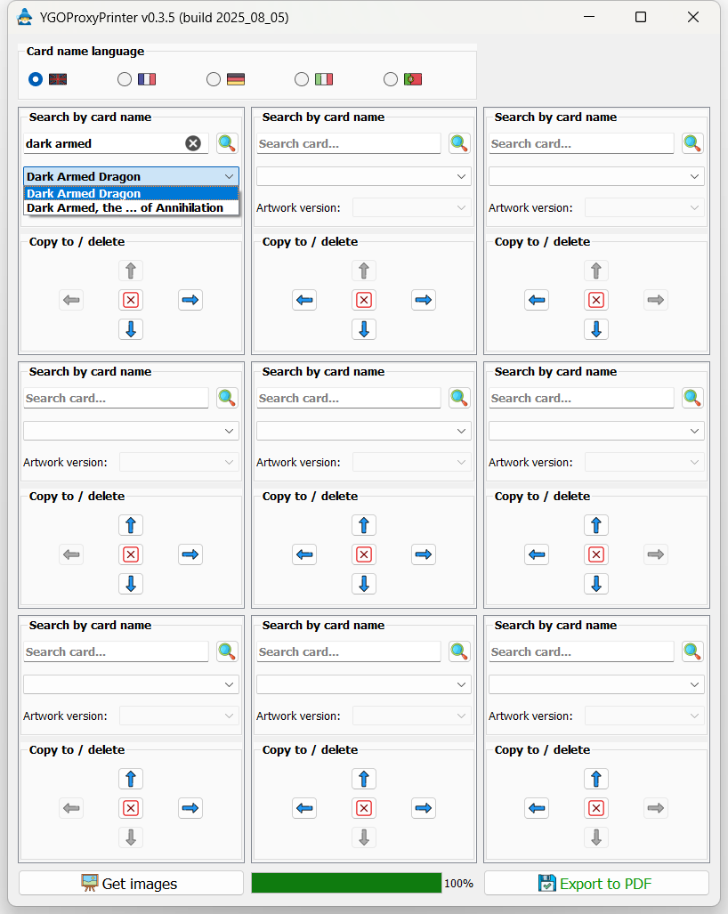
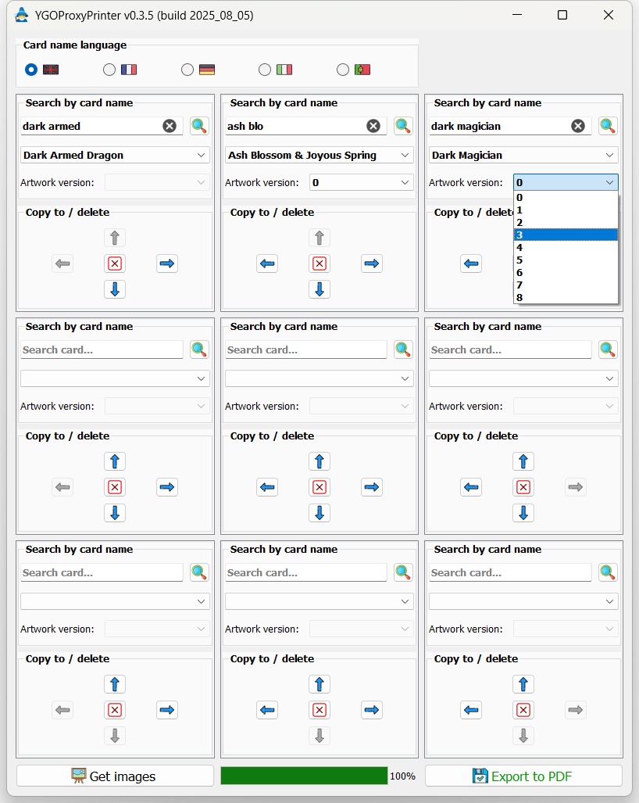
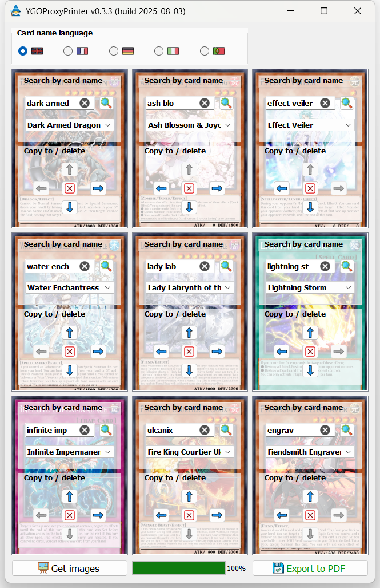

# YGO Proxy Printer tutorial
1. The interface consists of 9 boxes (3 rows and 3 columns):

1. Each box contains two groups: a first group which allows searching for a card name (from the https://www.ygoprodeck.com/ database), in which you may type a few letters and hit the Return button to run the search, and a dropdown list, which displays the search result(s) – if any;

1. And a second group which allows deleting the current search results for a given box (using the central  "delete" button), or copying the search result(s) of a neighbouring box (using one of the four ↑↓←→ arrow buttons):

1. Click "Get images" to pull each card's image from the server (ignores any box with no search results). The progress bar will start filling and you may stop the process using the "STOP" button:

1. If successful, the boxes will now display their respective card's image in the background (at this point, you may still change any of the boxes' contents, but you'll have to click "Get images" again to update the pictures):

1. You may export the result to a `.pdf` file using the "Export to PDF" button. If successful, the operation will show a prompt with two buttons, one of which allows the user to reveal the exported PDF in their OS's file browser:

1. The resulting PDF will have all cards with the correct size on an A4 page, with no spacing between the cards to facilitate the cutout process, and the document is ready to print (do not forget to check the "Actual size" check box of your PDF reader's printer interface):
