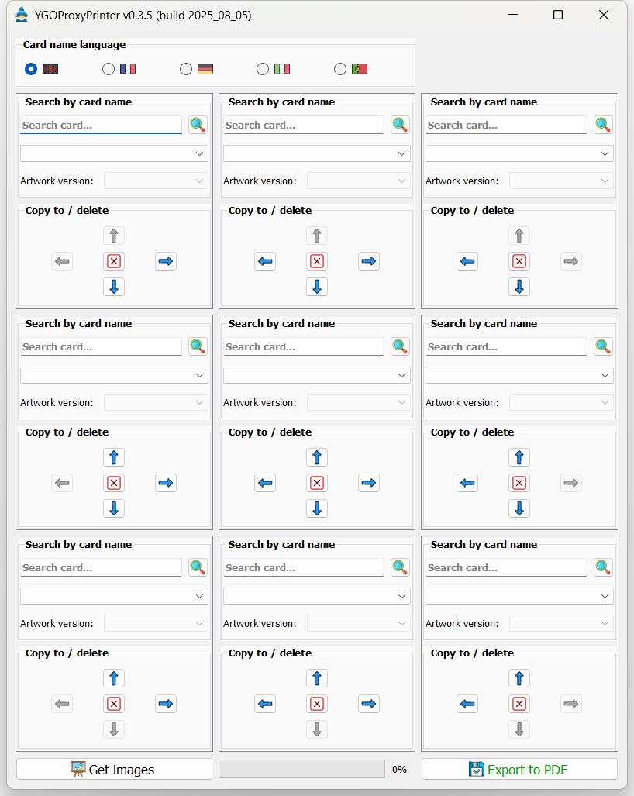
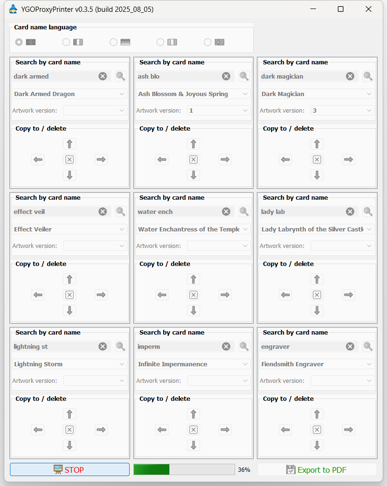
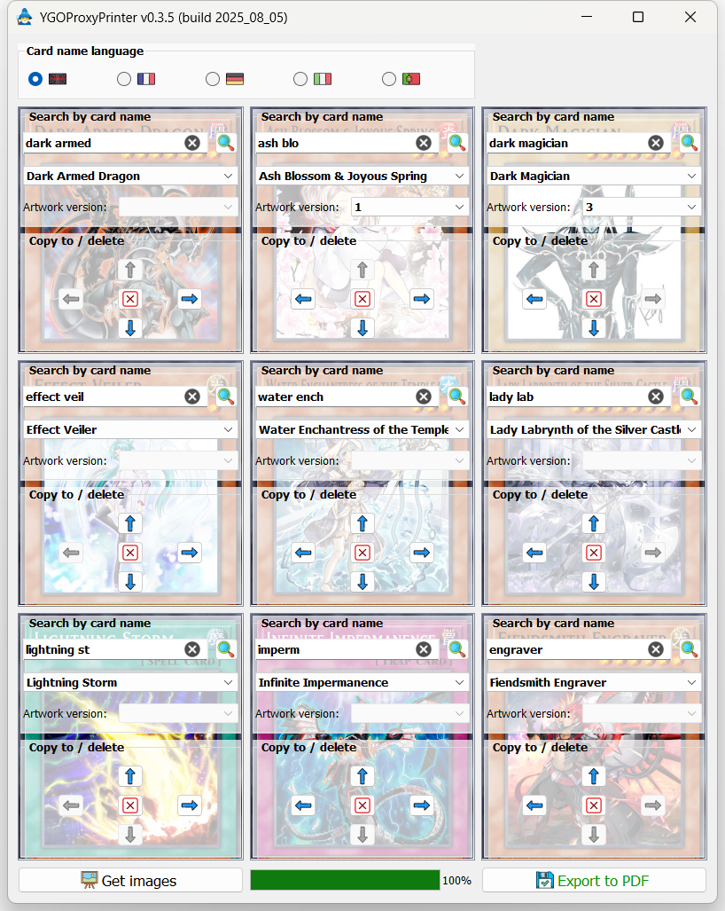
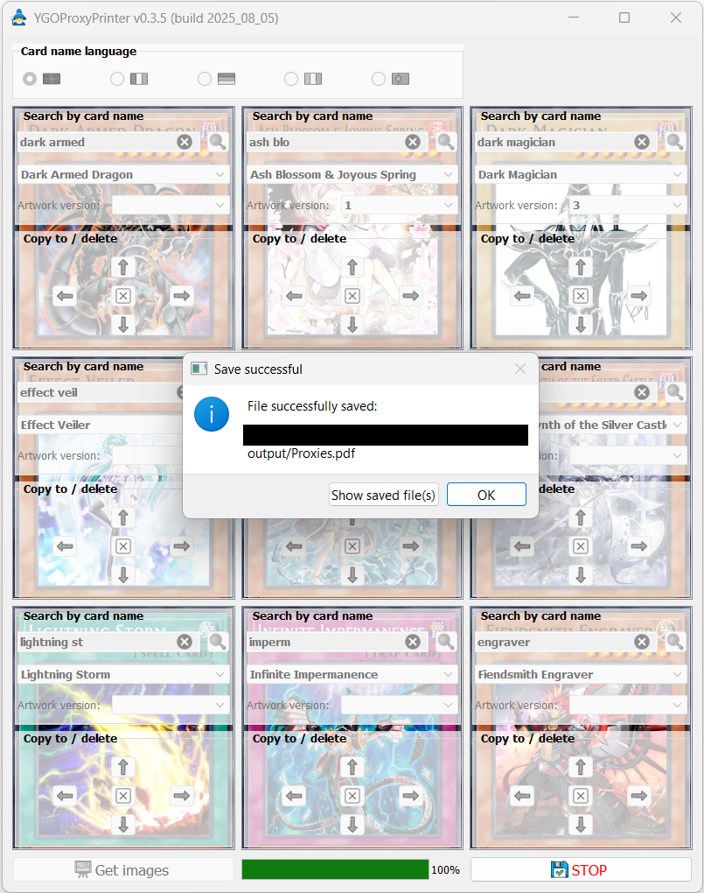

# YGO Proxy Printer tutorial
> [!NOTE]
> You can change the language of the search by clicking one of the flags at the top of the window. The current choices are:
> * English (default) 
> * French (Français) 
> * German (Deutsch) 
> * Italian (Italiano) 
> * Portuguese (Português) 

> [!WARNING]
> Note that changing the language of the search **will not affect the display language of the final card picture (only available in English for now)**.

* The interface consists of 9 boxes (3 rows and 3 columns):

* Each box contains two groups: The first group allows searching for a card name (from the https://www.ygoprodeck.com/ database). You may type a few letters and hit the Return button or click the  "search" button to run the search. The search result(s), if any, will be displayed in the dropdown list below the search bar, in the same box.

* In the second group, one can choose between deleting the current search results for the current box (using the central  "delete" button) and copying the search result(s) of the current box towards a neighbouring box (using one of the four  arrow buttons).

> [!NOTE]
> From version 0.3.5, it is now possible to select the desired artwork variant from any card that has two or more possible artworks from which to choose, using the dropdown menu which will be automatically available in that case. See the following example with "Dark Magician" which has 9 available artworks:
> 
> 

* Click  "Get images" to pull each card's image from the server (ignores any box with no search results). The progress bar will start filling and you may stop the process using the "STOP" button:

* If successful, the boxes will now display their respective card's image in the background (at this point, you may still change any of the boxes' contents, but you'll have to click  "Get images" again to update the pictures):

* You can export the result to a `.pdf` file using the  "Export to PDF" button. If successful, the operation will show a prompt with two buttons, one of which allows the user to reveal the exported PDF in their OS's file browser:

* The resulting PDF will have all cards with the correct size on an A4 page, with no spacing between the cards to facilitate the cutout process, and the document is ready to print (do not forget to check the "Actual size" check box of your PDF reader's printer interface):

